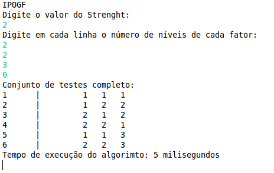

> **Project status:** complete :heavy_check_mark:  
> **Author:** Juliana Marino Balera :busts_in_silhouette:

# In Parameter Order General para interações de grau *n* (IPOG-F) :computer:

In-Parameter-Order para interações de grau *n* (IPOG-F) (Forbes, 2008) é um algoritmo  para a geração de dados de teste para Teste Combinatorial. Nesse repositório se encontra uma implementação do algoritmo IPO na linguagem de programação Java, que foi utilizada no contexto de uma dissertação de mestrado. 

## Aplicando Teste Combinatorial para a geração de testes de unidade :heavy_check_mark::x: 

Em linhas gerais, podemos dizer que o Teste Combinatorial, especificamente a técnica *Designs Combinatoriais*, se baseia na idéia de que a maioria das falhas de um software pode ser revelada através da submissão de todas as suas interações de fatores e níveis de acordo com um determinado grau de interação. No contexto do teste de unidade, fatores podem ser vistos como os parâmetros de um determinado método e os níveis os possíveis valores que cada um pode assumir. Assim por exemplo, em um método que tenha um parâmetro do tipo booleano ele poderá assumir no máximo dois valores, verdadeiro ou falso. Dessa forma, esse parâmetro especifico seria 1 fator com 2 níveis.

## Como utilizar :interrobang:

Para utilizar o algoritmo, basta rodar a classe "TesteCentral.java", como no exemplo a seguir. Observe que os fatores e níveis são inseridos um a um (são 3 fatores com respectivamente 2, 2 e 3 níveis cada um). Para terminar a passagem dos valores, basta digitar 0.

# Referências :books:

Forbes M, Lawrence J, Lei Y, Kacker RN, Kuhn DR. Refining the In-Parameter-Order Strategy for Constructing Covering Arrays. J Res Natl Inst Stand Technol. 2008;113(5):287-297. Published 2008 Oct 1. doi:10.6028/jres.113.022

Yu Lei and K. C. Tai, "In-parameter-order: a test generation strategy for pairwise testing," Proceedings Third IEEE International High-Assurance Systems Engineering Symposium (Cat. No.98EX231), Washington, DC, USA, 1998, pp. 254-261, doi: 10.1109/HASE.1998.731623.

BALERA, JULIANA M.; SANTIAGO JÚNIOR, VALDIVINO A. DE . An algorithm for combinatorial interaction testing: definitions and rigorous evaluations. JOURNAL OF SOFTWARE ENGINEERING RESEARCH AND DEVELOPMENT, v. 5, p. 1, 2017.

Balera, Juliana Marino; de Santiago Júnior, Valdivino Alexandre . T-Tuple Reallocation: An Algorithm to Create Mixed-Level Covering Arrays to Support Software Test Case Generation. In: O. Gervasi; B. Murgante; S. Misra; M. L. Gavrilova; A. M. A. C. Rocha; C. Torre; D. Taniar; B. O. Apduhan. (Org.). Lecture Notes in Computer Science. IVed.: Springer International Publishing, 2015, v. 9158, p. 503-517.
